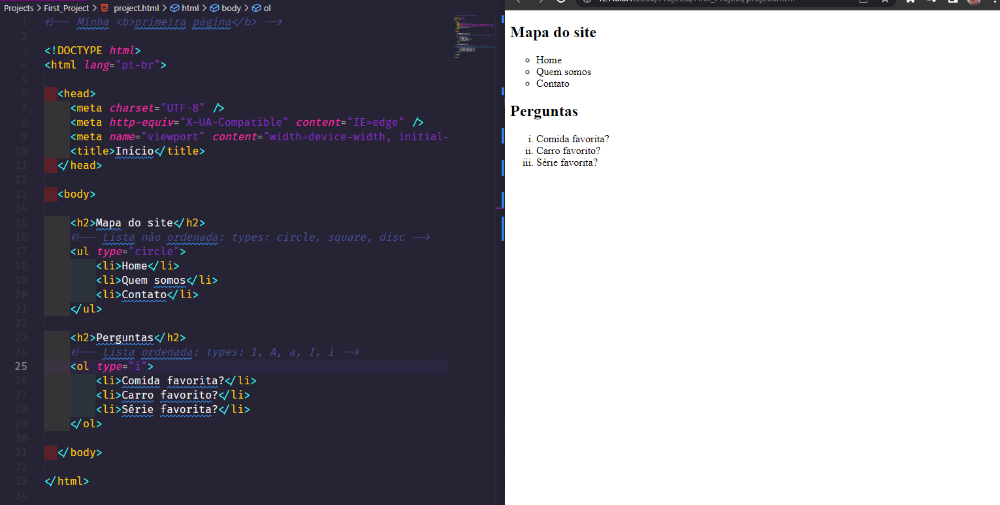
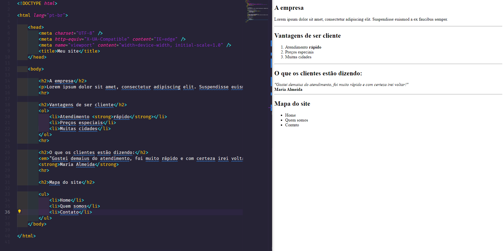
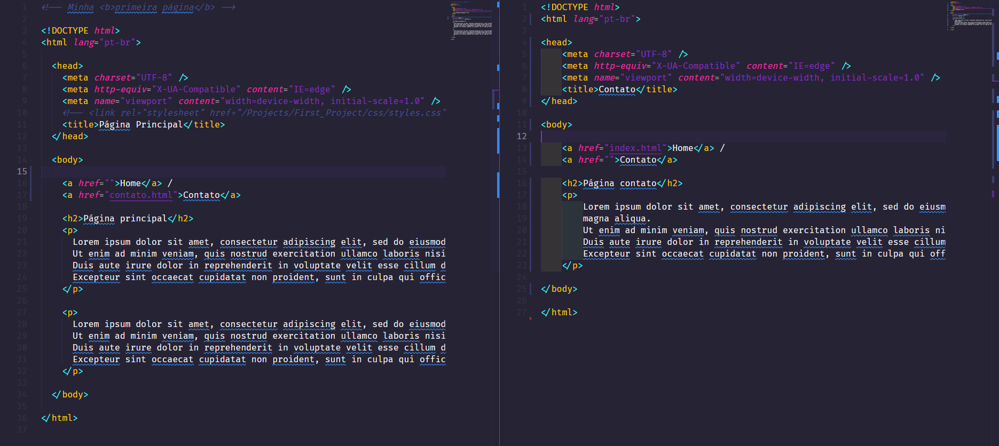
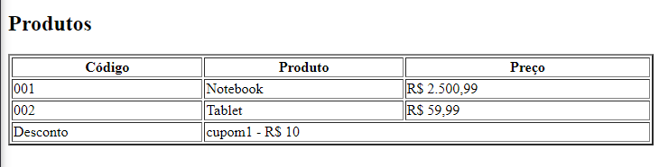
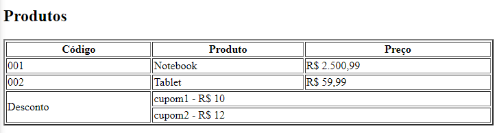
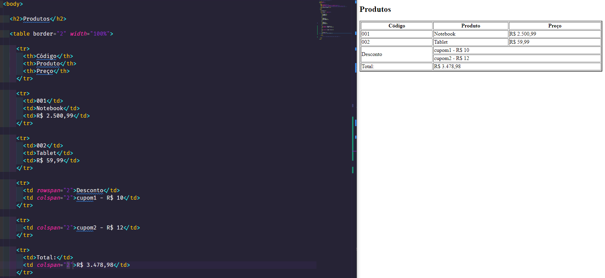
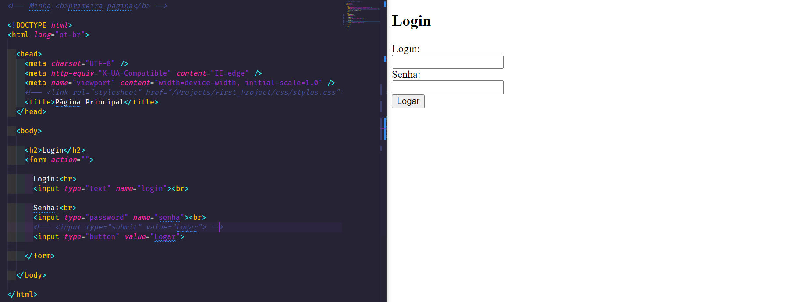
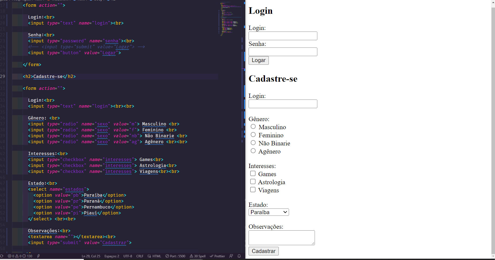

## Web Development Notes

## Folder Structure

- `css`: the folder to maintain css files
- `html`: the folder to maintain html files
- `javascript`: the folder to maintain js files
- `php`: the folder to maintain php files
- `Projects`: the folder to maintain projects
----------------------------------------------------------------------------

## Everything about Web Development

## HTML

### Html tags

- para abrir uma tag usamos os sinais de <>
----------------------------------------------------------------------------

### Tag DOCTYPE

- tag `DOCTYPE` (tipo de documento) `<!DOCTYPE html>` -> mostra para o browser o tipo de documento a ser usado, no caso aí é html
----------------------------------------------------------------------------

### Tag html

- tag `html` -> mostra para o browser que o código html ele tem começo e fim
----------------------------------------------------------------------------

### Tag head

- tag `head` (cabeça) -> onde configuramos informações que não aparecem para o usuário
----------------------------------------------------------------------------

### Tag body

- tag `body` (corpo) -> onde configuramos informações que aparecem direto para o usuário
----------------------------------------------------------------------------

### Tag title

- tag `title`  -> título da página
----------------------------------------------------------------------------

### Tag br

- tag `br` (break) ->  faz uma quebra de linha

#### Exemplo:

  `<body>`
    `Sobre a empresa   `
    `Essa é uma empresa tal.. `
  `</body>`

##### Console:
    Sobre a empresa
    Essa é uma empresa tal.. 
----------------------------------------------------------------------------

### Tag h

- tag `h` ou header (cabeçalho), temos:
    - `h1`
    - `h2`
    - `h3`

- vai do `h1` até o `h6`

----------------------------------------------------------------------------

### Tag p

- tag `p` -> faz um parágrafo
----------------------------------------------------------------------------

### Tag hr

- tag `hr` -> cria uma linha horizontal

### Tags de formatações de texto

- tag `bold` (negrito) `<b></b>` -> deixa um determinado texto em negrito, porém não é mais utilizada

- tag `strong` -> negrito atual 

- tag `em` -> deixa o texto em itálico

- tag `u` -> bota um underline no texto

- tag `strike` - corta o texto

#### Exemplo:

- `Minha <b>primeira página</b>`
----------------------------------------------------------------------------

### Listas Ordenadas e Não Ordenadas

#### Lista não ordenada

- usa-se a tag `ul` para fazer uma lista não ordenada
- usa-se a tag `ol` para fazer uma lista ordenada

##### unfocused:

- tag `li` (list item) -> itens da lista

#### Exemplos:

- Imagem

----------------------------------------------------------------------------

### Primeiro Mini Projeto, usando os básicos aprendidos

- Imagem

----------------------------------------------------------------------------

### Uso de imagens no HTML

- Quando se quer utilizar imagens no html, se usa a tag `img`, colocando o caminho de onde a imagem se encontra;
- Se caso queira utilizar a url da imagem, só colocar, porém não é muito recomendado, pois a imagem pode deixar de existir por um acaso.
- Podendo modificar a imagem usando width (largura) e height (altura)

#### Exemplos:

``  
``  
``

----------------------------------------------------------------------------

### Links no html

- Para colocar links na sua página você utiliza a tag `a` de anchor, que quer dizer âncora
- Pode também utilizar a anchor para interligar um outro site

#### Exemplos:

`<a href="contato.html">Contatos</a>` -> vai para página de contatos  
`<a href="https://www.youtube.com/">Clique aqui</a>` -> vai para o youtube

- Imagem

----------------------------------------------------------------------------

### Tabelas no html

- Para se usar uma tabela no html, usa-se a tag `table`, que no caso é tabela
- Dentro da `table`, pode-se colocar atributos, como `border` (borda), colocando os demais tipos de borda: 1, 2, 3... 
- para ser feita a tabela em si, precisa-se de linhas e colunase dados
- Para definir um a linha usa-se a tag `tr`, ou table row (linha da tabela)
- Para definir os dados de uma tabela, usa-se a tag `td`, ou table data (dados da tabela)
- Se quiser diferenciar os títulos dos dados, usa-se a tag `th`, ou table header (título da tabela)
- Podendo usar o `width` para definir a largura da tabela, usando porcentagem de 100%, toma todo o espaço do navegador
- Também podendo colocar imagem na tabela e links
- Para mesclagem de colunas, usa-se o `colspan`, que é a extensão da coluna
- Para mesclagem de linhas, usa-se o `rowspan`, que é a extensão da linha 

#### Exemplos:

`<td></td>`  
`<td><a href="">Clique</a></td>`  
`<td colspan="2">cupom1 - R$ 10</td>`  
`<td rowspan="2">Desconto</td>`  

----------------------------------------------------------------------------

### Formulários no html
- Os formulários `form` são feitos para cadastros e login, usando `input`, para digitar

#### Exemplos:

----------------------------------------------------------------------------

### Caracteres Especiais

